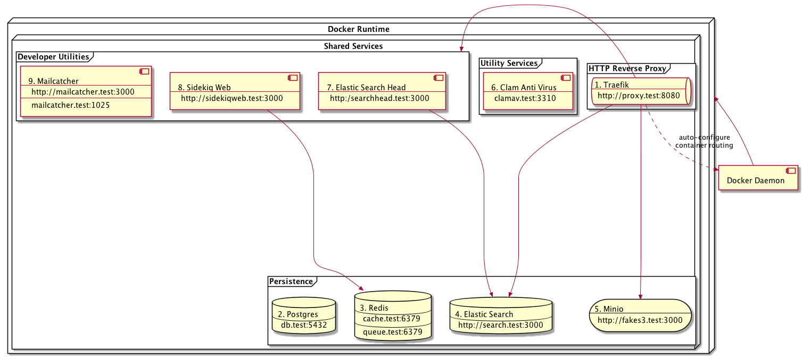
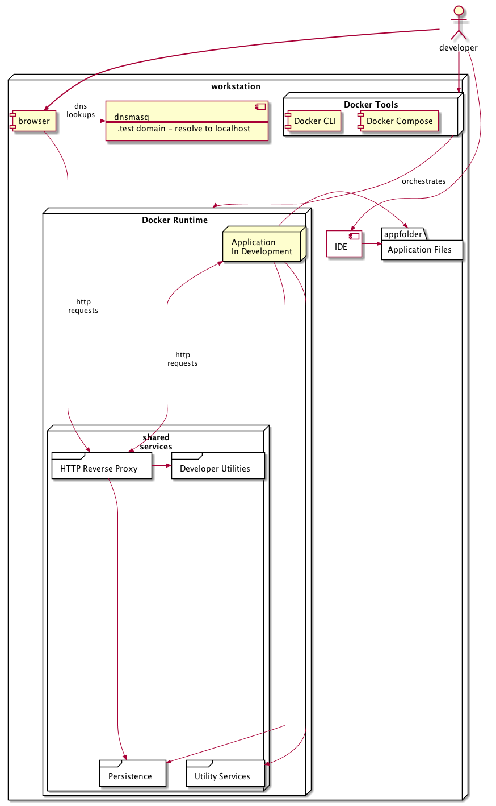

# Shared Services Readme

## Getting Started

In order to use the shared-services in your project, dnsmasq and the macos resolver has to be configured to resolve hosts in the .test domain.

* [Install homebrew](https://brew.sh)
* cd to the shared-services folder and run `bin/install-mac`.
  Enter your password when prompted - some parts of the script need to run via `sudo` (you will need to be a local administrator on your machine).

## Components

The diagram below shows the components that are available within the shared services environment:-

1. Traefik is used to handle all HTTP traffic for shared services components that use that protocol and also for the applications you are developing.
    + It is configured to connect to the docker daemon in order to watch for containers being launched or removed.
    + It forwards traffic to other http containers via port 3000 on your workstation.
    + There is also a web console available that can be used to check that your container is setup to route correctly as [http://proxy.test:8080](http://proxy.test:8080)
    + Traefik reconfigures it's routing when it detects changes via docker labels.
    + More information is available here [Traefik docker documentation](https://docs.traefik.io/configuration/backends/docker/)
2. Postgres is our standard SQL database which is served on the standard postgresql port 5432
    + username: app
    + password: app
    + default database: app (your application should setup it's own database)
3. Redis is used for caching, server side sessions and as an asynchronous queue (we use sidekiq for our asynchronous jobs). There are 2 redis instances:-
    + queue.test:6379 - this instance persists it's database to disk
    + cache.test:6379 - this instance only uses RAM to store it's database
4. Elastic Search is used as a search index and is accessed via http at [http://search.test:3000](http://search.test:3000)
5. Minio is used to simulate a local AWS S3 storage service. There is a web UI which you can used to manage buckets and navigate the file store at [http://fakes3.test:3000](http://fakes3.test:3000)
    + username: anything
    + password: anything
6. Clamav is used for virus scanning files. If your application allows users to upload files then they should be virus scanned with clamav
7. Elastic search head is used with elastic search, it is possible to inspect indexes at [http://searchhead.test:3000](http://searchhead.test:3000)
8. Sidekiq web is a web UI tool that allows you to inspect the asynchronous job queues in redis at [http://sidekiqweb.test:3000](http://sidekiqweb.test:3000)
9. Mailcatcher is used for testing email messaging, you can access the web interface at [http://mailcatcher.test:3000](http://mailcatcher.test:3000)

## Development

The diagram below shows the MacOS envrionment configured to develop applications with the Shared Services project

